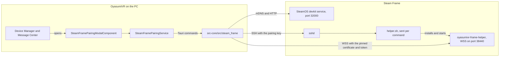
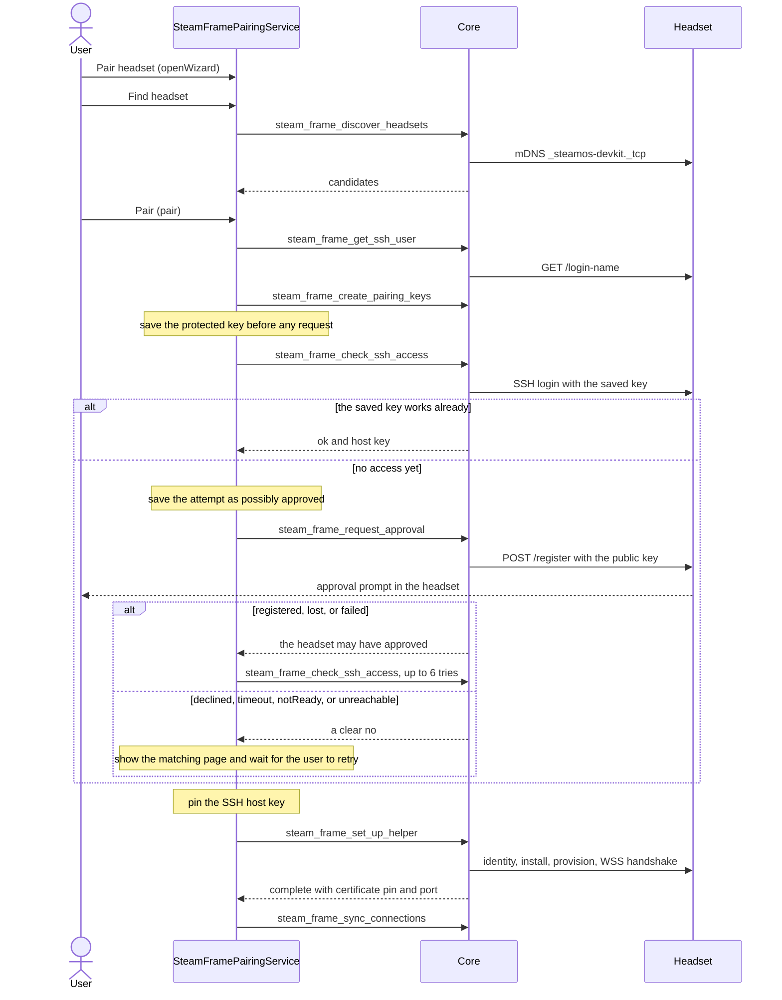
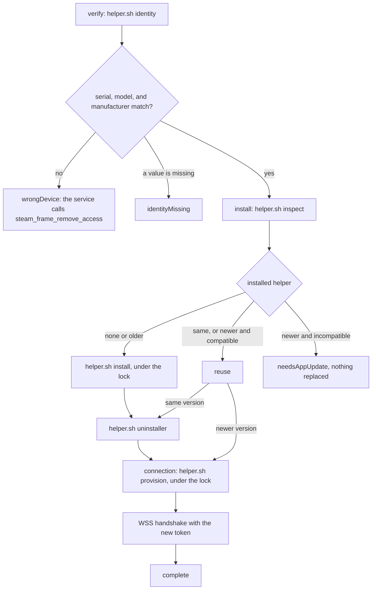
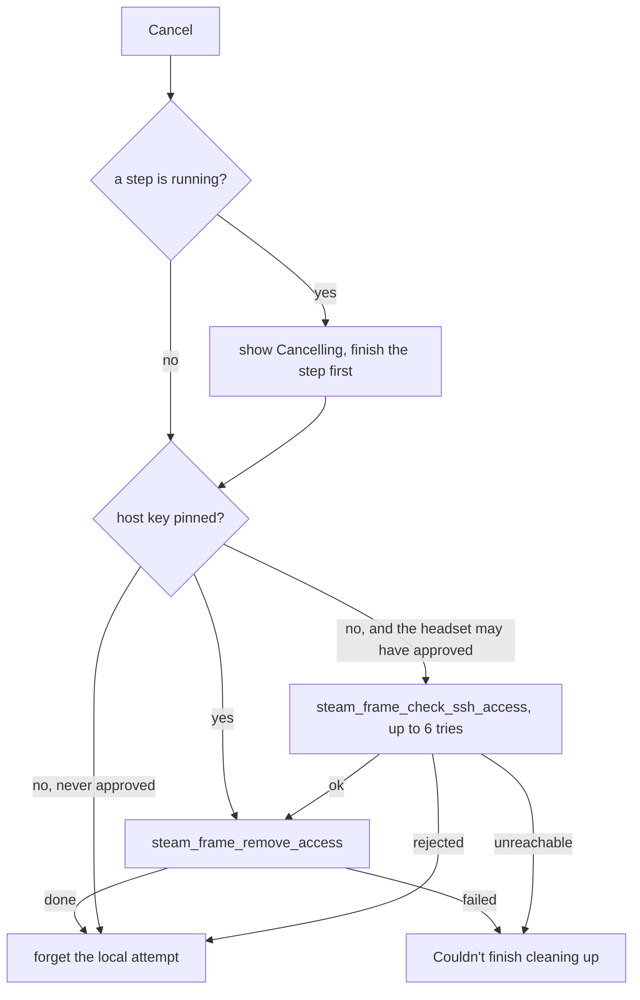
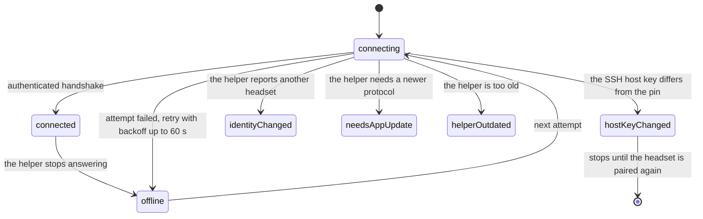

# Steam Frame pairing

OyasumiVR pairs with a Steam Frame, installs a small helper on the headset, and keeps a connection
to that helper. This page shows which parts take part, which Tauri command runs when, and why.

## Parts

The service stores each pairing in `settings.dat` under `STEAM_FRAME_PAIRING`. The private key and
the helper token pass through `protectSecret` before the first save.

## Commands

| Command                             | Called by                                   | When                                                                                                                              |
| ----------------------------------- | ------------------------------------------- | --------------------------------------------------------------------------------------------------------------------------------- |
| `steam_frame_get_supported_models`  | service `init`                              | app start, to decide where Pair headset shows                                                                                     |
| `steam_frame_get_connection_states` | service `init`                              | app start, for statuses the core already has                                                                                      |
| `steam_frame_discover_headsets`     | `discover`                                  | the wizard's Find headset step                                                                                                    |
| `steam_frame_get_ssh_user`          | `connectManual`, `pair`                     | a typed address, and before each pairing                                                                                          |
| `steam_frame_create_pairing_keys`   | `preparePairing`                            | the first pairing attempt for a headset; retries reuse the key                                                                    |
| `steam_frame_check_ssh_access`      | `register`, `confirmAccess`, `finishCancel` | before every approval request, after a `registered`, `lost`, or `failed` answer, and on Cancel when the headset may have approved |
| `steam_frame_request_approval`      | `register`                                  | only after a user action, when the saved key does not work yet                                                                    |
| `steam_frame_set_up_helper`         | `runSetup`                                  | after SSH access works; Retry calls it again                                                                                      |
| `steam_frame_remove_access`         | `finishCancel`, different headset           | Cancel after approval, and a wrong headset                                                                                        |
| `steam_frame_sync_connections`      | `pushPairings`                              | after every change to the completed pairings                                                                                      |

The core emits two events. `STEAM_FRAME_SETUP_STAGE` reports the setup step, and `installed` once
this attempt installed the helper. `STEAM_FRAME_CONNECTION_STATE` reports each pairing's status.

## Pairing

The service saves the attempt as possibly approved before the request leaves, because the headset
can approve it even when the answer never arrives. A clear no puts the earlier value back. An answer
of `lost` or `failed` can still mean the headset approved the key, so the service probes SSH before
it shows "Approval couldn't be confirmed". It never sends a second registration by itself.

## Setup on the headset

`steam_frame_set_up_helper` runs these `helper.sh` commands over one SSH session. The stage names
match the wizard's progress list.

- `install` checks under the lock that the helper did not change since `inspect`. If it did, it
  reports busy, and Retry decides again.
- `provision` writes `clients/<pc-id>` and `clients/<pc-id>.pub`, starts or restarts the service,
  and returns the port and certificate. The core pins that certificate.
- Every step is safe to repeat, so Retry continues without a new approval.

## Error codes

The wizard shows a code under each error message, so a user report names the failure without a log
file. `ERROR_CODES` in `steam-frame-pairing-modal.component.ts` maps them from `flow.error`.

| Code   | `flow.error`            | What failed                                                                  |
| ------ | ----------------------- | ---------------------------------------------------------------------------- |
| SF-101 | `persistence`           | a settings write on this PC                                                  |
| SF-102 | `keys`                  | creating the SSH key pair (`steam_frame_create_pairing_keys`)                |
| SF-201 | `offline`               | setup could not reach the headset over SSH                                   |
| SF-202 | `identityMissing`       | `steamvr.vrsettings` on the headset lacks the serial, model, or manufacturer |
| SF-203 | `helperBusy`            | another PC held the helper lock for 45 s                                     |
| SF-204 | `setupFailed`           | any other setup failure; the core logs the message                           |
| SF-301 | `wrongDeviceAccessLeft` | cleanup on a wrong headset did not report done                               |

## Cancel

`steam_frame_remove_access` runs `helper.sh cleanup`. It removes this PC's key line and token file,
plus the helper when this attempt installed it and no other PC has a token. "Couldn't finish
cleaning up" shows `bash ~/.local/share/oyasumivr_helper/uninstall`.

## Connection

The core keeps one connection per completed pairing, and `steam_frame_sync_connections` replaces the
list.

A failed WSS attempt takes one of three recovery paths before it counts as offline:

- `Unauthorized`: the helper lost this PC's token. The core runs `helper.sh provision` over SSH and
  tries again.
- `CertificateChanged`: the core reads the certificate over SSH, and pins it only when it matches the
  one the helper presented.
- `Unreachable`: the core browses mDNS for the headset at a new address, and accepts it only when that
  helper presents the pinned certificate.

## On the headset

| Path                                                    | What it holds                                       |
| ------------------------------------------------------- | --------------------------------------------------- |
| `~/.local/share/oyasumivr_helper/releases/<version>`    | installed helper versions                           |
| `~/.local/share/oyasumivr_helper/current`               | link to the running version                         |
| `~/.local/share/oyasumivr_helper/config.json`           | the WSS port                                        |
| `~/.local/share/oyasumivr_helper/tls/`                  | the helper's certificate and key                    |
| `~/.local/share/oyasumivr_helper/clients/<pc-id>`       | one token per paired PC, plus its `.pub` key record |
| `~/.local/share/oyasumivr_helper/maintenance.lock`      | held by install, provision, and cleanup             |
| `~/.local/share/oyasumivr_helper/uninstall`             | removes the helper and every recorded key line      |
| `~/.ssh/.oyasumivr-keys.lock`                           | held by every `authorized_keys` rewrite             |
| `~/.config/systemd/user/oyasumivr-frame-helper.service` | the user service                                    |
