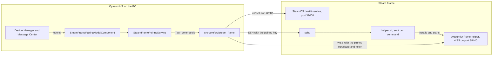
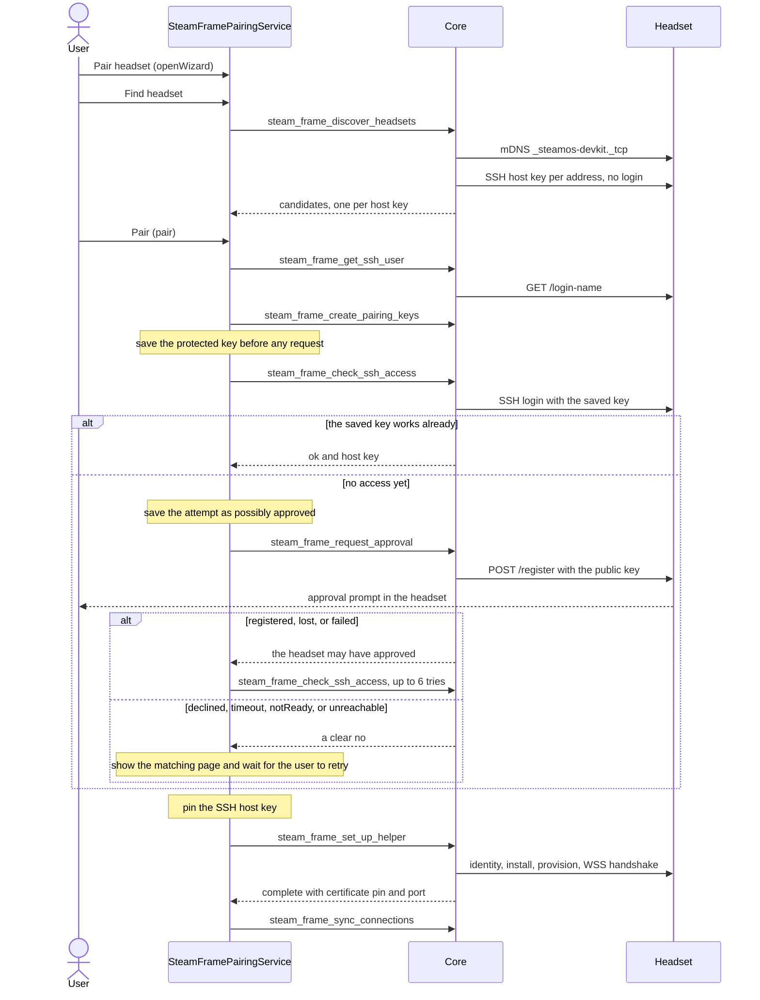
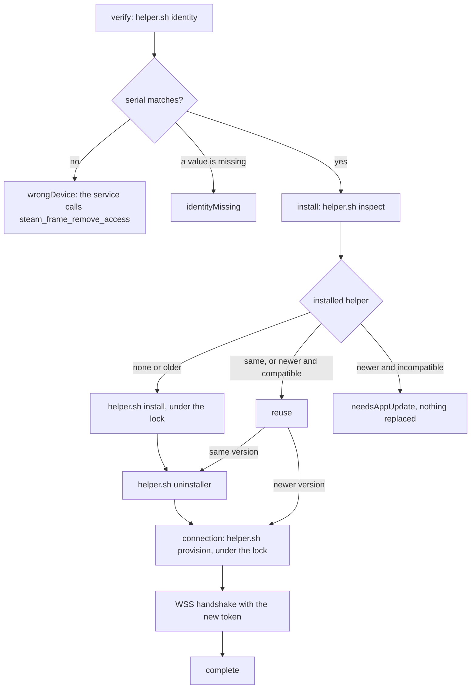
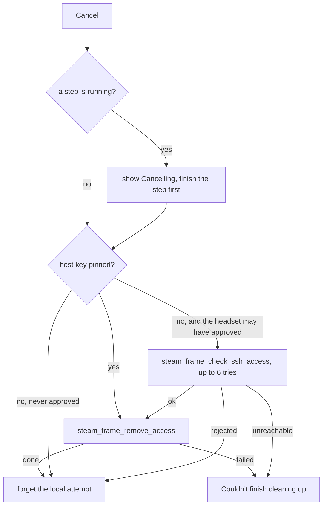
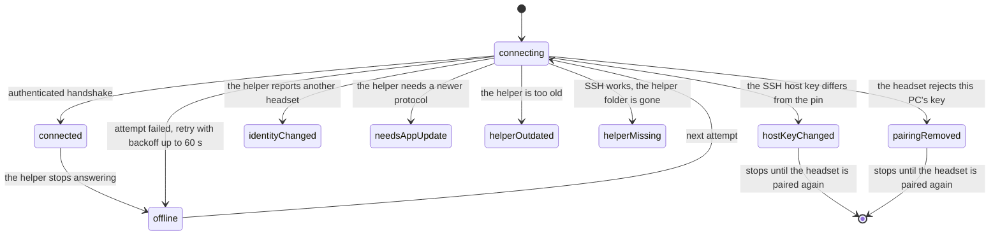
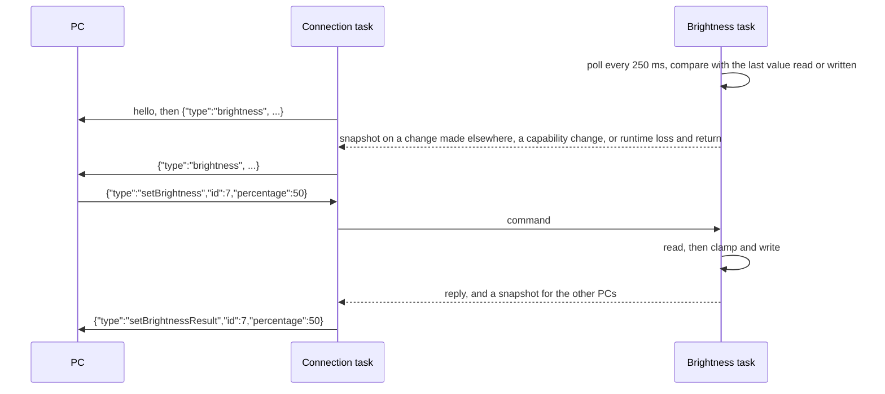
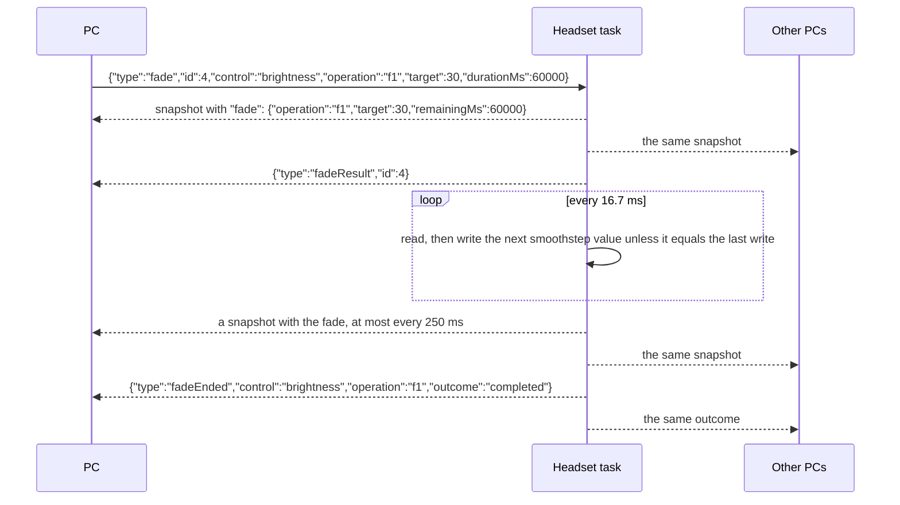
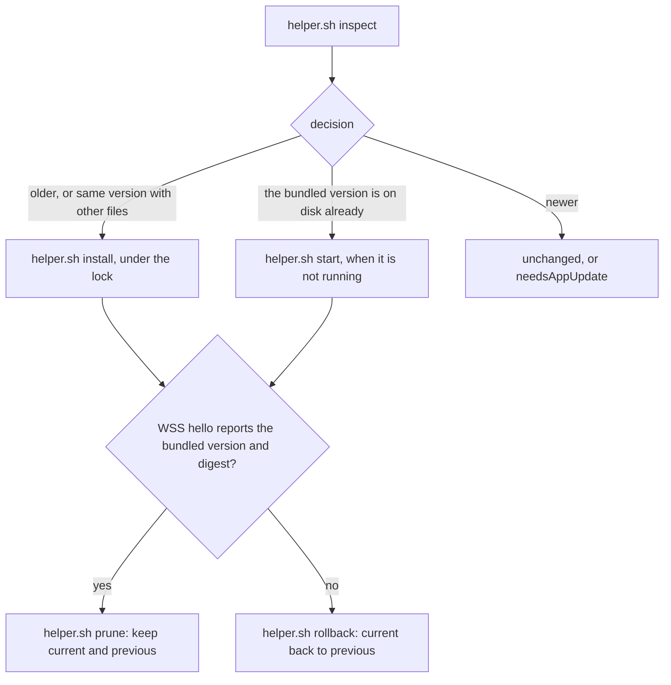

# Steam Frame pairing

OyasumiVR pairs with a Steam Frame, installs a small helper on the headset, and keeps a connection
to that helper. This page shows which parts take part, which Tauri command runs when, and why.

## Parts

```mermaid
flowchart LR
  subgraph PC [OyasumiVR on the PC]
    UI["Device Manager and Message Center"]
    Wizard["SteamFramePairingModalComponent"]
    Service["SteamFramePairingService"]
    Core["src-core/src/steam_frame"]
  end
  subgraph Headset [Steam Frame]
    Devkit["SteamOS devkit service, port 32000"]
    Sshd["sshd"]
    Script["helper.sh, sent per command"]
    Helper["oyasumivr-frame-helper, WSS on port 38440"]
  end
  UI -- opens --> Wizard
  Wizard --> Service
  Service -- Tauri commands --> Core
  Core -- "mDNS and HTTP" --> Devkit
  Core -- "SSH with the pairing key" --> Sshd
  Sshd --> Script
  Script -- "installs and starts" --> Helper
  Core -- "WSS with the pinned certificate and token" --> Helper
```

The service stores each pairing in `settings.dat` under `STEAM_FRAME_PAIRING`. The private key and
the helper token pass through `protectSecret` before the first save.

## Commands

| Command                             | Called by                                   | When                                                                                                                              |
| ----------------------------------- | ------------------------------------------- | --------------------------------------------------------------------------------------------------------------------------------- |
| `steam_frame_get_supported_models`  | service `init`                              | app start, to decide where Pair headset shows                                                                                     |
| `steam_frame_get_connection_states` | service `init`                              | app start, for statuses the core already has                                                                                      |
| `steam_frame_discover_headsets`     | `discover`                                  | the wizard's Find headset step                                                                                                    |
| `steam_frame_get_ssh_user`          | `connectManual`, `pair`                     | a typed address, and before each pairing                                                                                          |
| `steam_frame_create_pairing_keys`   | `preparePairing`                            | the first pairing attempt for a headset; retries reuse the key                                                                    |
| `steam_frame_check_ssh_access`      | `register`, `confirmAccess`, `finishCancel` | before every approval request, after a `registered`, `lost`, or `failed` answer, and on Cancel when the headset may have approved |
| `steam_frame_request_approval`      | `register`                                  | only after a user action, when the saved key does not work yet                                                                    |
| `steam_frame_set_up_helper`         | `runSetup`                                  | after SSH access works; Retry calls it again                                                                                      |
| `steam_frame_remove_access`         | `finishCancel`, different headset, `unpair` | Cancel after approval, a wrong headset, and Unpair                                                                                |
| `steam_frame_count_other_pcs`       | the unpair dialog                           | before it offers Unpair and Uninstall helper                                                                                      |
| `steam_frame_sync_connections`      | `pushPairings`                              | after every change to the completed pairings                                                                                      |
| `steam_frame_update_helper`         | Update and Retry in Device Manager          | a manual helper update; the result arrives as connection state                                                                    |
| `steam_frame_set_brightness`        | the Frame brightness driver                 | each brightness write; the reply carries the value the helper applied                                                             |
| `steam_frame_set_cct`               | the Frame color temperature driver          | each color temperature write; the reply carries the snapshot the helper applied                                                   |
| `steam_frame_fade`                  | `SteamFrameFadeTask`                        | each brightness transition; the reply accepts or refuses it                                                                       |
| `steam_frame_cancel_fade`           | the same                                    | a cancelled transition, by its operation ID                                                                                       |

The core emits three events. `STEAM_FRAME_SETUP_STAGE` reports the setup step, and `installed` once
this attempt installed the helper. `STEAM_FRAME_CONNECTION_STATE` reports each pairing's status.
`STEAM_FRAME_FADE_ENDED` passes on each `fadeEnded` from the helper, with the pairing id.

## Pairing

```mermaid
sequenceDiagram
  actor User
  participant S as SteamFramePairingService
  participant C as Core
  participant H as Headset

  User->>S: Pair headset (openWizard)
  User->>S: Find headset
  S->>C: steam_frame_discover_headsets
  C->>H: mDNS _steamos-devkit._tcp
  C->>H: SSH host key per address, no login
  C-->>S: candidates, one per host key
  User->>S: Pair (pair)
  S->>C: steam_frame_get_ssh_user
  C->>H: GET /login-name
  S->>C: steam_frame_create_pairing_keys
  Note over S: save the protected key before any request
  S->>C: steam_frame_check_ssh_access
  C->>H: SSH login with the saved key
  alt the saved key works already
    C-->>S: ok and host key
  else no access yet
    Note over S: save the attempt as possibly approved
    S->>C: steam_frame_request_approval
    C->>H: POST /register with the public key
    H-->>User: approval prompt in the headset
    alt registered, lost, or failed
      C-->>S: the headset may have approved
      S->>C: steam_frame_check_ssh_access, up to 6 tries
    else declined, timeout, notReady, or unreachable
      C-->>S: a clear no
      Note over S: show the matching page and wait for the user to retry
    end
  end
  Note over S: pin the SSH host key
  S->>C: steam_frame_set_up_helper
  C->>H: identity, install, provision, WSS handshake
  C-->>S: complete with certificate pin and port
  S->>C: steam_frame_sync_connections
```

The service saves the attempt as possibly approved before the request leaves, because the headset
can approve it even when the answer never arrives. A clear no puts the earlier value back. An answer
of `lost` or `failed` can still mean the headset approved the key, so the service probes SSH before
it shows "Approval couldn't be confirmed". It never sends a second registration by itself.

## Setup on the headset

`steam_frame_set_up_helper` runs these `helper.sh` commands over one SSH session. The stage names
match the wizard's progress list.

```mermaid
flowchart TD
  A["verify: helper.sh identity"] --> B{"serial matches?"}
  B -- "no" --> W["wrongDevice: the service calls steam_frame_remove_access"]
  B -- "a value is missing" --> M["identityMissing"]
  B -- "yes" --> C["install: helper.sh inspect"]
  C --> D{"installed helper"}
  D -- "none or older" --> E["helper.sh install, under the lock"]
  D -- "same, or newer and compatible" --> F["reuse"]
  D -- "newer and incompatible" --> N["needsAppUpdate, nothing replaced"]
  E --> G["helper.sh uninstaller"]
  F -- "same version" --> G
  F -- "newer version" --> H
  G --> H["connection: helper.sh provision, under the lock"]
  H --> I["WSS handshake with the new token"]
  I --> J["complete"]
```

- `install` checks under the lock that the helper did not change since `inspect`. If it did, it
  reports busy, and Retry decides again.
- `provision` writes `clients/<pc-id>` and `clients/<pc-id>.pub`, starts or restarts the service,
  and returns the port and certificate. The core pins that certificate.
- Every step is safe to repeat, so Retry continues without a new approval.

## Error codes

The wizard shows a code under each error message, so a user report names the failure without a log
file. `ERROR_CODES` in `steam-frame-pairing-modal.component.ts` maps them from `flow.error`.

| Code   | `flow.error`            | What failed                                                                  |
| ------ | ----------------------- | ---------------------------------------------------------------------------- |
| SF-101 | `persistence`           | a settings write on this PC                                                  |
| SF-102 | `keys`                  | creating the SSH key pair (`steam_frame_create_pairing_keys`)                |
| SF-201 | `offline`               | setup could not reach the headset over SSH                                   |
| SF-202 | `identityMissing`       | `steamvr.vrsettings` on the headset lacks the serial, model, or manufacturer |
| SF-203 | `helperBusy`            | another PC held the helper lock for 60 s                                     |
| SF-204 | `setupFailed`           | any other setup failure; the core logs the message                           |
| SF-301 | `wrongDeviceAccessLeft` | cleanup on a wrong headset did not report done                               |

Device Manager shows these in the explanation of a problem pill, from `FRAME_STATUS_ROWS`, the
maintenance pills, and `UPDATE_FAILURE_CODES`:

| Code   | Connection status    | What happened                                                     |
| ------ | -------------------- | ----------------------------------------------------------------- |
| SF-401 | `identityChanged`    | the helper reports another headset's serial                       |
| SF-402 | `hostKeyChanged`     | the SSH host key at the address differs from the pinned one       |
| SF-403 | `needsAppUpdate`     | the helper's lowest protocol is above this build's                |
| SF-406 | `helperMissing`      | SSH works, but the helper folder is gone                          |
| SF-407 | maintenance `busy`   | another PC held the maintenance lock for 60 s                     |
| SF-408 | a failed Reinstall   | setup did not complete; the core logs the outcome                 |
| SF-411 | update `unreachable` | the SSH session to the headset dropped during the update          |
| SF-412 | update `corrupted`   | the uploaded helper did not match the bundled digest              |
| SF-413 | update `notStarted`  | the new helper did not answer, so the previous release runs again |
| SF-414 | update `notBundled`  | this build carries no helper                                      |
| SF-415 | update `other`       | any other update failure; the core logs the message               |

SF-404 (`helperOutdated`) has no explanation: its Update helper pill starts the update.

## Cancel

```mermaid
flowchart TD
  A["Cancel"] --> B{"a step is running?"}
  B -- "yes" --> C["show Cancelling, finish the step first"]
  C --> D
  B -- "no" --> D{"host key pinned?"}
  D -- "no, and the headset may have approved" --> E["steam_frame_check_ssh_access, up to 6 tries"]
  E -- "ok" --> F
  E -- "rejected" --> G["forget the local attempt"]
  E -- "unreachable" --> X["Couldn't finish cleaning up"]
  D -- "no, never approved" --> G
  D -- "yes" --> F["steam_frame_remove_access"]
  F -- "done" --> G
  F -- "failed" --> X
```

`steam_frame_remove_access` runs `helper.sh cleanup` with mode `unused` when this attempt installed
the helper, and `keep` otherwise. Every mode removes this PC's key lines and token file. `unused` also
removes the helper when no other PC has a token. "Couldn't finish cleaning up" shows
`bash ~/.local/share/oyasumivr_helper/uninstall`.

Every other SSH session starts with `helper.sh record`, which writes `clients/<pc-id>.pub` while the
helper is installed. The uninstall script on the headset reads those files to find every OyasumiVR
key line.

## Unpair

Device details open `SteamFrameUnpairModalComponent`. It counts the other PCs with a token, then
offers two modes of `helper.sh cleanup`:

- Unpair runs `unused`: the helper stays for the other PCs, and goes with this PC's access when no
  other PC holds a token.
- Uninstall helper, offered only when other PCs hold a token, runs `uninstall`: it stops the
  service and removes it with the helper folder. Other PCs keep their key lines, so they see
  `helperMissing`.

A cleanup takes the maintenance and authorized_keys locks before it changes anything, reports busy
when it cannot get them, and removes the key lines last, so Try again can finish a partial cleanup.
The service deletes the local pairing only after the headset reports `done`. Otherwise the dialog
shows "Couldn't unpair" with Forget, and with Try again unless the headset rejects this PC's key or
its host key changed, because retrying cannot help then. Cancel cleanup and wrong-headset cleanup
count a rejected key as done.

Forget deletes only local data. Its page keeps the terminal uninstall command folded under "Can't
unpair from any PC?", for a headset no paired PC can reach. A pairing whose key the headset rejects
shows `pairingRemoved`. Device Manager shows it like an unpaired headset, and the Forget button in
its device details opens the Forget page.

## Connection

The core keeps one connection per completed pairing, and `steam_frame_sync_connections` replaces the
list.

```mermaid
stateDiagram-v2
  [*] --> connecting
  connecting --> connected: authenticated handshake
  connected --> offline: the helper stops answering
  connecting --> offline: attempt failed, retry with backoff up to 60 s
  offline --> connecting: next attempt
  connecting --> hostKeyChanged: the SSH host key differs from the pin
  connecting --> identityChanged: the helper reports another headset
  connecting --> needsAppUpdate: the helper needs a newer protocol
  connecting --> helperOutdated: the helper is too old
  connecting --> helperMissing: SSH works, the helper folder is gone
  connecting --> pairingRemoved: the headset rejects this PC's key
  hostKeyChanged --> [*]: stops until the headset is paired again
  pairingRemoved --> [*]: stops until the headset is paired again
```

A failed WSS attempt takes one of three recovery paths before it counts as offline:

- `Unauthorized`: the helper lost this PC's token. The core runs `helper.sh provision` over SSH and
  tries again.
- `CertificateChanged`: the core reads the certificate over SSH, and pins it only when it matches the
  one the helper presented.
- `Unreachable`: the core logs in over SSH and runs `helper.sh start`. When the helper still does not
  answer, it repairs the current release and then rolls back to the previous one, once per app start
  and separately from the automatic update.
  A missing helper folder shows `helperMissing`, and only Reinstall creates it again. When SSH cannot
  reach the headset, or another host answers at its old address, the core browses mDNS for it at a
  new address, and accepts it only when that helper presents the pinned certificate.

## Brightness

The helper runs one brightness task with one SteamVR session, opened as a background app from the
runtime in `openvrpaths.vrpath`. It reads `steamvr.analogGain` and the HMD's analog gain capability
every 250 ms, and it only writes on a PC's command.

```mermaid
sequenceDiagram
  participant P as PC
  participant C as Connection task
  participant T as Brightness task
  T->>T: poll every 250 ms, compare with the last value read or written
  C->>P: hello, then {"type":"brightness", ...}
  T-->>C: snapshot on a change made elsewhere, a capability change, or runtime loss and return
  C->>P: {"type":"brightness", ...}
  P->>C: {"type":"setBrightness","id":7,"percentage":50}
  C->>T: command
  T->>T: read, then clamp and write
  T-->>C: reply, and a snapshot for the other PCs
  C->>P: {"type":"setBrightnessResult","id":7,"percentage":50}
```

- A snapshot has `runtime`, `supported`, and, while supported, `min`, `max`, and `percentage`. The
  percentage can lie outside the bounds. The bounds are 9%–125% within the HMD's gain limits.
- The percentage uses the Index curve: gain = (p/100)^2.2 below 100%, p/100 from there.
- A reply has `percentage` or `error`: `unsupported`, `runtimeUnavailable`, or `writeFailed`. The
  core adds `offline` when no connection is open or it closes before the reply.
- The core keeps the last snapshot in the connection state as `brightness`, updates its percentage
  from each reply, and clears it while not connected.

On the PC, `SteamFrameHardwareBrightnessControlDriver` matches while the paired Frame is the active
OpenVR HMD, so the hardware brightness service picks it before the Frame can take a set. It is
available while the connection is `connected` and the report says `supported`. It keeps one command
in flight and replaces a waiting one with the newest value. A value set while the Frame cannot take
it waits and goes out once the Frame reports, unless it waited longer than two minutes. Its reports
reach the hardware brightness cache without a write, and simple mode derives its value from them.
Simple mode gives every matching driver its hardware part, so a paired Frame that has not reported
yet gets that part once it reports. Transitions run as helper fades, described under
[Fades](#fades).

## Color temperature

The brightness task also tracks `steamvr.hmdDisplayColorGainR`, `G`, and `B` in the same SteamVR
session. It polls them after brightness every 250 ms and compares each channel with the last value
read or written, at a tolerance of 1e-5. An unset key reads as 1.0. It writes only on a PC's
command, and sends `{"type":"cct", ...}` after the brightness snapshot on connect.

- A snapshot has `available` and, while available, `gains`, `kelvin`, and `exact`. `kelvin` is the
  integer in 1000–10000 whose gains lie nearest to the read gains divided by their largest channel.
  `exact` says the gains equal that Kelvin's gains. `src-shared-rust/src/color_temperature.rs`
  holds the conversion, and the helper builds that file through a `#[path]` module.
- `{"type":"setCct","id":3,"kelvin":3000}` reads first, clamps to 1000–10000, and writes the three
  channels unless they already match. The reply has `snapshot` or `error`: `runtimeUnavailable` or
  `writeFailed`. The core adds `offline`.
- A PC gets no snapshot for its own write, and every other PC gets one when the write changed the
  gains. The core keeps the last snapshot as `cct` in the connection state.

On the PC, `SteamFrameCctControlDriver` sends CCT through the helper while the paired Frame is the
active OpenVR HMD, its connection is `connected`, and the report says `available`. It keeps one
command in flight and replaces a waiting one with the newest value. Reports reach the shown value
without a write, and a set to the shown Kelvin writes when `exact` is false. The driver also matches
an allowlisted Frame model without that path and drops its sets then, so the SteamVR color gain
driver never writes the PC's own gains while a Frame is the active HMD. The driver keeps the newest
value set while the paired Frame cannot take it, such as the HMD connect automation's, and sends it
once the Frame reports, unless it waited longer than two minutes. `CCTControlService` hands every
set to the matching driver, and a driver with `pushesCctChanges` owns the shown value. Transitions
set their target in one command.

## Fades

The helper runs brightness and color temperature transitions itself, so a fade finishes while no
PC is connected. It steps each fade at 60 Hz in the same task that polls, and every step reads
before it writes, as a set does.

```mermaid
sequenceDiagram
  participant P as PC
  participant T as Headset task
  participant O as Other PCs
  P->>T: {"type":"fade","id":4,"control":"brightness","operation":"f1","target":30,"durationMs":60000}
  T-->>P: snapshot with "fade": {"operation":"f1","target":30,"remainingMs":60000}
  T-->>O: the same snapshot
  T-->>P: {"type":"fadeResult","id":4}
  loop every 16.7 ms
    T->>T: read, then write the next smoothstep value unless it equals the last write
  end
  T-->>P: a snapshot with the fade, at most every 250 ms
  T-->>O: the same snapshot
  T-->>P: {"type":"fadeEnded","control":"brightness","operation":"f1","outcome":"completed"}
  T-->>O: the same outcome
```

- A fade starts from the value read at acceptance and ends on `target`, in percent or Kelvin. A
  brightness fade can carry `"simple": {"from": 80, "to": 0}`. The helper then eases the simple
  value and maps each step to hardware with the split in `SimpleBrightnessControlService`, so
  hardware holds its minimum while the simple value is below it.
- The reply is `fadeResult` with an `error` when refused: `unsupported`, `runtimeUnavailable`,
  or `writeFailed`. A fade longer than 24 hours gets no reply.
- `fadeEnded` goes to every PC with one outcome:

| Outcome              | Cause                                                                      |
| -------------------- | -------------------------------------------------------------------------- |
| `completed`          | the last step wrote the target                                             |
| `superseded`         | a set or fade command for the same control, from any PC                    |
| `cancelled`          | `{"type":"cancelFade","operation":"f1"}` from any PC; other IDs do nothing |
| `externalChange`     | a read found that control changed on the headset                           |
| `standby`            | headset standby, or a system suspend; ends both controls' fades            |
| `runtimeUnavailable` | SteamVR stopped; ends both controls' fades                                 |

A brightness command never ends a color temperature fade, and the reverse.

### Headset standby

The helper reads the HMD's activity level at every poll and before every write. Level Standby
means headset standby. The helper also treats a system suspend as standby entry: the boot clock
then runs more than a second ahead of the monotonic clock between two ticks.

During standby a set writes as usual, and a fade writes its target at once and reports
`completed`. The helper remembers what it wrote. On leaving standby it reads both controls and
writes a remembered value once more when the read differs, because the runtime may not keep a
write made in standby. A cancelled fade never resumes.

### On the PC

The brightness services know only `DeviceFade`, a `CancellableTask` for a fade the device runs
itself. A driver returns one from `fade()`, and the base driver returns null, so other headsets
keep the PC transition. A `DeviceFade` ends as `completed`, `changedOnDevice`, `deviceGone`, or
`stopped`.

`SteamFrameFadeTask` is the Frame driver's `DeviceFade` for one helper fade.

- It cuts a fade longer than 24 hours to 24 hours, because the helper does not reply to one.
- It completes on `completed`, and every other outcome cancels it. `externalChange` and `missed`
  end it as `changedOnDevice`, the other outcomes as `stopped`. Cancelling it from outside sends
  `cancelFade` with its operation ID.
- A fade for a paired Frame that does not report yet waits for the first report, then runs at
  full length. When that report comes after the fade's planned end, the task completes without a
  fade, and the driver keeps the target as a set.
- While the connection is down it completes at its end time. When a report after a reconnect no
  longer carries its fade, it ends as `missed`.
- A refused fade fails the task with the helper's error, and the service that started it sets the
  target instead.
- A connected state without a report counts as down, because a helper update clears the reports
  without leaving `connected`.
- When another headset becomes the active HMD during a fade, the task ends as `deviceGone` and
  sends `cancelFade`. The service then sets the fade's target on the driver of the next headset,
  which keeps it until that headset can take it. A service whose driver changes ends the fade the
  same way before it writes anything else, so the next headset gets the target, not the value the
  fade had reached.
- In simple mode the software part runs for the duration the device runs, which is at most 24
  hours.

In simple mode the device runs the hardware part of the simple curve, and the PC runs the software
part on the same curve from the accept reply. On `completed` the software part ends on its target,
because the device can complete first, such as in standby. On `changedOnDevice` the software part
stops and the simple value follows the headset, as for any report. On any other end the software
part stops where it is. In advanced mode the software transition runs on the PC as before, so a
headset change ends only the hardware fade.

## Updates

Each connection compares the helper's hello with the bundled helper. An older helper, or the same
version with a different executable digest, gets one automatic update per app start. The user can
start the same update from Device Manager at any time.

```mermaid
flowchart TD
  A["helper.sh inspect"] --> B{"decision"}
  B -- "older, or same version with other files" --> C["helper.sh install, under the lock"]
  B -- "the bundled version is on disk already" --> S["helper.sh start, when it is not running"]
  B -- "newer" --> U["unchanged, or needsAppUpdate"]
  C --> V{"WSS hello reports the bundled version and digest?"}
  S --> V
  V -- "yes" --> P["helper.sh prune: keep current and previous"]
  V -- "no" --> R["helper.sh rollback: current back to previous"]
```

- Every command that takes the lock deletes `staging/` first. `install` then checks the helper did
  not change since `inspect`, uploads into `staging/`, checks the digest, moves the release into
  place, points `previous` at the old release, switches `current`, and restarts the service. A second
  PC that waited for the lock finds the new helper and changes nothing.
- A same-version repair replaces the executable in place. When no other `previous` release exists,
  it first keeps a copy as `releases/<version>.replaced` and points `previous` at it, so rollback
  always has a working target. A failed first installation removes the helper folder again.
- `rollback <version>` changes nothing and exits 73 when `current` no longer points at that release,
  so a PC never rolls back a helper another PC just installed.
- An interrupted update needs no record. The next contact finds the old helper still running, the new
  release on disk but not running, or the new helper running, and finishes from there.
- The connection state carries `maintenance`: `updating`, `updated` for a minute, `failed` with a
  reason, or `busy` when another PC held the lock for 60 seconds.
- An update restarts the helper without waiting for a fade. The fade stops where it was, and no
  `fadeEnded` follows for it.

## On the headset

| Path                                                    | What it holds                                                    |
| ------------------------------------------------------- | ---------------------------------------------------------------- |
| `~/.local/share/oyasumivr_helper/releases/<version>`    | installed helper versions                                        |
| `~/.local/share/oyasumivr_helper/current`               | link to the running version                                      |
| `~/.local/share/oyasumivr_helper/previous`              | link to the version before it, for rollback                      |
| `~/.local/share/oyasumivr_helper/staging/`              | the upload in progress                                           |
| `~/.local/share/oyasumivr_helper/config.json`           | the WSS port                                                     |
| `~/.local/share/oyasumivr_helper/tls/`                  | the helper's certificate and key                                 |
| `~/.local/share/oyasumivr_helper/clients/<pc-id>`       | one token per paired PC, plus its `.pub` key record              |
| `~/.local/share/oyasumivr_helper/maintenance.lock`      | held by every change to the helper folder                        |
| `~/.local/share/oyasumivr_helper/uninstall`             | removes the helper and every recorded key line                   |
| `~/.ssh/.oyasumivr-keys.lock`                           | held by every `authorized_keys` rewrite; deleted with the helper |
| `~/.config/systemd/user/oyasumivr-frame-helper.service` | the user service                                                 |
