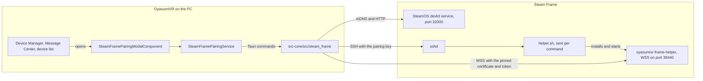
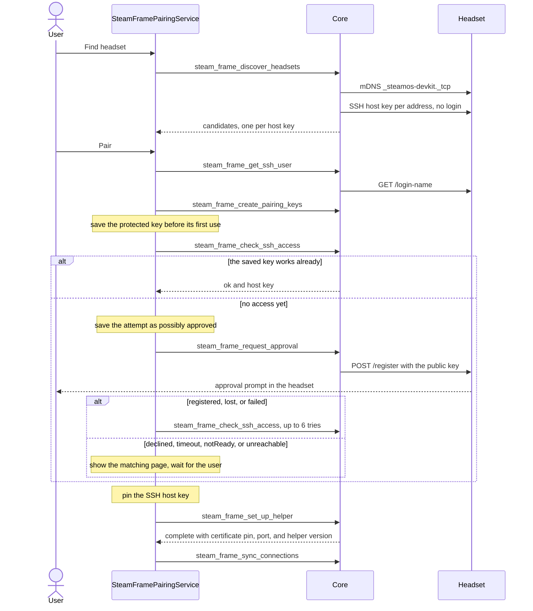
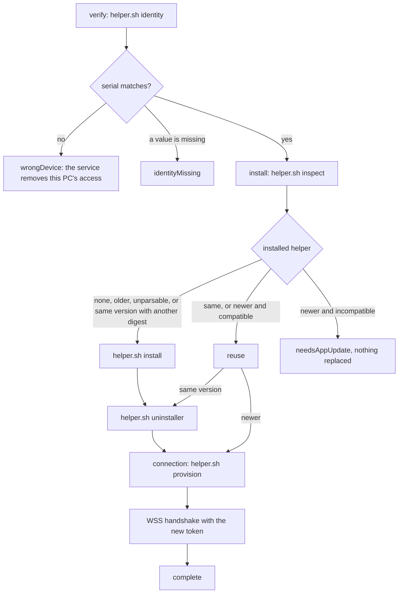
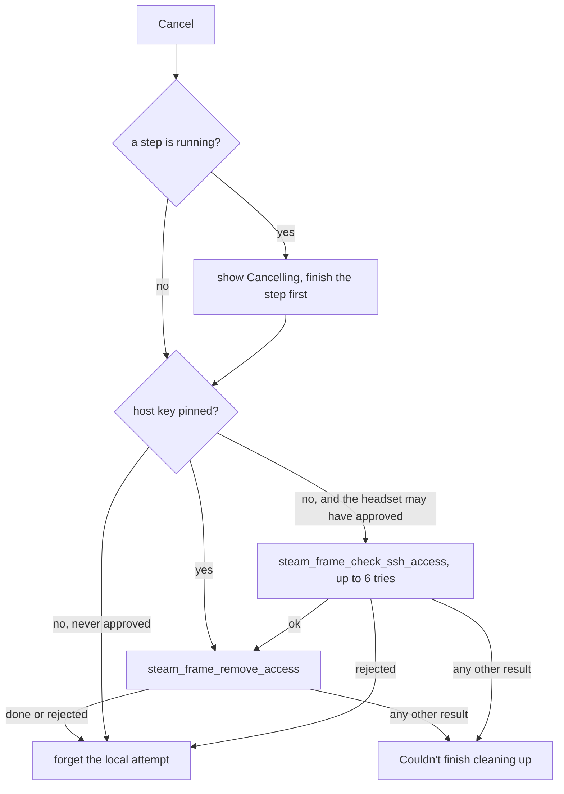
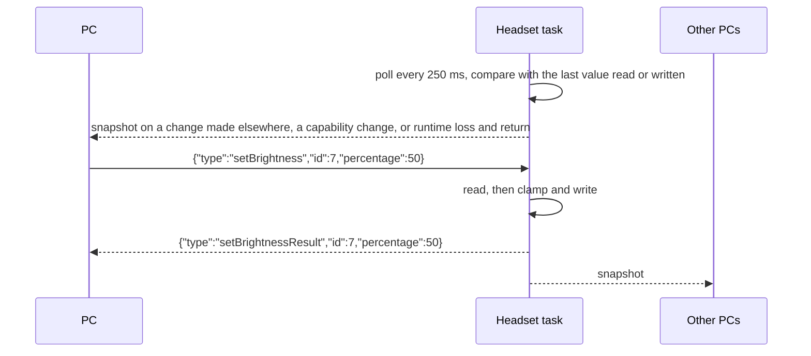
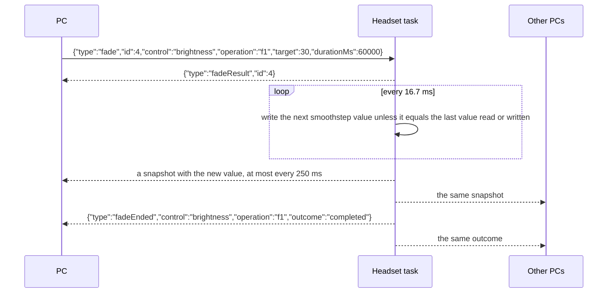
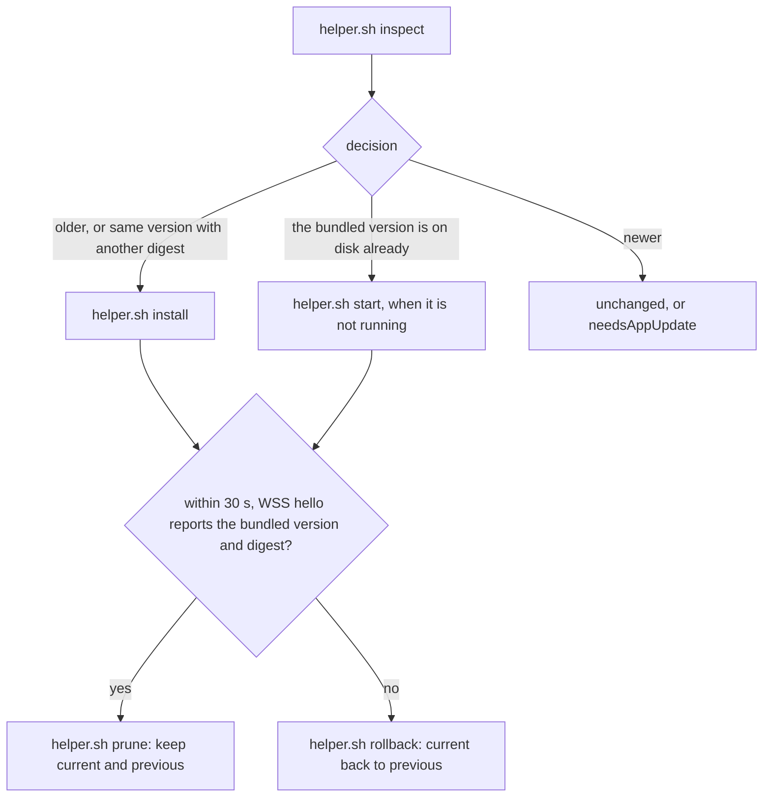

# Steam Frame pairing

OyasumiVR pairs with a Steam Frame over SSH, installs a helper on the headset, and keeps a WSS
connection to it. The helper owns the headset's brightness, color temperature, and fades. This page
covers each side's contract and the rules the code does not show at a glance.

## Parts

```mermaid
flowchart LR
  subgraph PC [OyasumiVR on the PC]
    UI["Device Manager, Message Center, device list"]
    Wizard["SteamFramePairingModalComponent"]
    Service["SteamFramePairingService"]
    Core["src-core/src/steam_frame"]
  end
  subgraph Headset [Steam Frame]
    Devkit["SteamOS devkit service, port 32000"]
    Sshd["sshd"]
    Script["helper.sh, sent per command"]
    Helper["oyasumivr-frame-helper, WSS on port 38440"]
  end
  UI -- opens --> Wizard
  Wizard --> Service
  Service -- Tauri commands --> Core
  Core -- "mDNS and HTTP" --> Devkit
  Core -- "SSH with the pairing key" --> Sshd
  Sshd --> Script
  Script -- "installs and starts" --> Helper
  Core -- "WSS with the pinned certificate and token" --> Helper
```

| Where                                      | What                                                                       |
| ------------------------------------------ | -------------------------------------------------------------------------- |
| `src-ui/app/services/steam-frame/`         | the pairing service, which owns the wizard flow, and the fade task         |
| `src-ui/app/components/steam-frame/`       | the pairing wizard and the unpair dialog                                   |
| `src-ui/app/services/*-control/*-drivers/` | the Frame brightness and color temperature drivers                         |
| `src-core/src/steam_frame/`                | Tauri commands, discovery, SSH setup, connections, helper updates          |
| `src-core/src/steam_frame/helper.sh`       | the commands the core runs on the headset; its header lists the exit codes |
| `src-frame-helper/`                        | the helper, built for `aarch64-unknown-linux-gnu`                          |

The core emits three events: `STEAM_FRAME_SETUP_STAGE`, `STEAM_FRAME_CONNECTION_STATE`, and
`STEAM_FRAME_FADE_ENDED`.

The service stores the pairings in `settings.dat` under `STEAM_FRAME_PAIRING`. Every save encrypts
the private key and the helper token with `protectSecret`. `load` skips a pairing whose secrets do
not decrypt.

## Pairing

The wizard opens from Device Manager, from the Message Center invitation, and from the device list.
The service holds the flow, so closing the wizard mid-step keeps it running, and reopening shows it.

```mermaid
sequenceDiagram
  actor User
  participant S as SteamFramePairingService
  participant C as Core
  participant H as Headset

  User->>S: Find headset
  S->>C: steam_frame_discover_headsets
  C->>H: mDNS _steamos-devkit._tcp
  C->>H: SSH host key per address, no login
  C-->>S: candidates, one per host key
  User->>S: Pair
  S->>C: steam_frame_get_ssh_user
  C->>H: GET /login-name
  S->>C: steam_frame_create_pairing_keys
  Note over S: save the protected key before its first use
  S->>C: steam_frame_check_ssh_access
  alt the saved key works already
    C-->>S: ok and host key
  else no access yet
    Note over S: save the attempt as possibly approved
    S->>C: steam_frame_request_approval
    C->>H: POST /register with the public key
    H-->>User: approval prompt in the headset
    alt registered, lost, or failed
      S->>C: steam_frame_check_ssh_access, up to 6 tries
    else declined, timeout, notReady, or unreachable
      Note over S: show the matching page, wait for the user
    end
  end
  Note over S: pin the SSH host key
  S->>C: steam_frame_set_up_helper
  C-->>S: complete with certificate pin, port, and helper version
  S->>C: steam_frame_sync_connections
```

- The headset can approve a key even when its answer never arrives. So the service saves the
  attempt as possibly approved before the request leaves, and a clear no puts the earlier value
  back. After `lost` or `failed` it probes SSH before it shows "Approval couldn't be confirmed".
- The service sends a registration only on a user action, never a second one by itself.
- `lost` means the request left but no answer came back, such as after the core's 60 s wait.
  `timeout` comes from the headset.
- A retry of an unfinished attempt reuses its key. Pair again on a completed pairing creates new
  keys and a new record, and the sync stops the old connection.

## Setup on the headset

`steam_frame_set_up_helper` runs these `helper.sh` commands over one SSH session. The stage names
match the wizard's progress list. Device Manager's Reinstall, for `helperMissing`, runs the same
command with the saved identity.

```mermaid
flowchart TD
  A["verify: helper.sh identity"] --> B{"serial matches?"}
  B -- "no" --> W["wrongDevice: the service removes this PC's access"]
  B -- "a value is missing" --> M["identityMissing"]
  B -- "yes" --> C["install: helper.sh inspect"]
  C --> D{"installed helper"}
  D -- "none, older, unparsable, or same version with another digest" --> E["helper.sh install"]
  D -- "same, or newer and compatible" --> F["reuse"]
  D -- "newer and incompatible" --> N["needsAppUpdate, nothing replaced"]
  E --> G["helper.sh uninstaller"]
  F -- "same version" --> G
  F -- "newer" --> H
  G --> H["connection: helper.sh provision"]
  H --> I["WSS handshake with the new token"]
  I --> J["complete"]
```

- The core refuses before any SSH when the identity is not in `SUPPORTED_MODELS`. The match on the
  headset compares only the serial.
- `install` exits 73 when the helper changed since `inspect`. The core then inspects and decides
  again, and fails on the third exit 73.
- `provision` writes `clients/<pc-id>` and `clients/<pc-id>.pub`, starts or restarts the service,
  and returns the port and certificate. The core pins that certificate.
- Every step is safe to repeat, so Retry continues without a new approval.

The core logs the cause of every failure. The wizard shows the error kind as a line under the
current page, and a setup failure without its own page lands on the setup-failed page.

## Cleanup

`helper.sh cleanup` has two modes:

- `unused` removes this PC's key lines and token, and the whole helper when no other PC holds a
  token. Cancel, a wrong headset, and Unpair use it.
- `uninstall` stops and removes the service and the helper folder. Other PCs keep their key lines,
  so they see `helperMissing`.

A cleanup takes the `authorized_keys` lock, and the maintenance lock while the helper folder
exists, before it changes anything. It removes the key lines last, so a retry finishes a partial
cleanup. `clients/<pc-id>.pub` lets the uninstall script find every OyasumiVR key line.

```mermaid
flowchart TD
  A["Cancel"] --> B{"a step is running?"}
  B -- "yes" --> C["show Cancelling, finish the step first"]
  C --> D
  B -- "no" --> D{"host key pinned?"}
  D -- "no, and the headset may have approved" --> E["steam_frame_check_ssh_access, up to 6 tries"]
  E -- "ok" --> F
  E -- "rejected" --> G["forget the local attempt"]
  E -- "any other result" --> X["Couldn't finish cleaning up"]
  D -- "no, never approved" --> G
  D -- "yes" --> F["steam_frame_remove_access"]
  F -- "done or rejected" --> G
  F -- "any other result" --> X
```

"Couldn't finish cleaning up" shows `bash ~/.local/share/oyasumivr_helper/uninstall`.

The unpair dialog opens from the device details. It counts the other PCs with a token, then offers
Unpair, plus Uninstall helper when another PC holds a token. The service deletes the local pairing
only after the headset reports `done`. Otherwise the dialog shows "Couldn't unpair" with Forget.
It adds Try again unless the headset rejects this PC's key or its host key changed.

Forget deletes only local data. Its page keeps the terminal uninstall command folded under "Can't
unpair from any PC?". Device Manager's Forget on a known device that is not connected also forgets
its pairing. A pairing whose key the headset rejects shows `pairingRemoved`, and Device Manager
treats it as unpaired.

## Connection

The core keeps one connection task per completed pairing. `steam_frame_sync_connections` replaces
the list and restarts a task only when its pairing changed, so a stopped task stays stopped.

| Status           | Meaning                                                                 |
| ---------------- | ----------------------------------------------------------------------- |
| `connecting`     | the task started, or an automatic update runs                           |
| `connected`      | an authenticated handshake, and the helper speaks this build's protocol |
| `offline`        | the attempt failed, or the helper stopped answering                     |
| `helperOutdated` | the helper's highest protocol is below this build's                     |
| `needsAppUpdate` | the helper's lowest protocol is above this build's                      |
| `helperMissing`  | SSH works, but the helper folder is gone; only Reinstall creates it     |
| `hostKeyChanged` | the SSH host key differs from the pin; the task stops                   |
| `pairingRemoved` | the headset rejects this PC's key; the task stops                       |

- Attempts back off from 2 s, doubling up to 60 s. A connected session or an update request resets
  the backoff.
- A connected task pings every 15 s and drops the socket after 40 s without an answer.
- A command waits 5 s for its reply, then fails as `offline`.

Three WSS errors get a repair before the attempt counts as `offline`. A repair retries at once, at
most twice per backoff step.

- `Unauthorized`: the helper lost this PC's token. The core runs `helper.sh provision` and tries
  again.
- `CertificateChanged`: the core runs `helper.sh provision` and pins the returned certificate only
  when it matches the one the helper presented.
- `Unreachable`: the core runs `helper.sh start`. When the helper still does not answer, it installs
  the bundled helper unless a newer one is there. When that does not start either, it rolls back to
  the previous release. It repairs once per app start, apart from the automatic update.
- When SSH cannot reach the headset, or another host answers at its old address, the core browses
  mDNS for the headset at a new address. It accepts that address only when the helper there
  presents the pinned certificate.

## Brightness and color temperature

The helper runs one headset task with one SteamVR session, opened as a background app from the
runtime in `openvrpaths.vrpath`. Every 250 ms it reads `steamvr.analogGain`, the HMD's analog gain
capability, and `steamvr.hmdDisplayColorGainR`, `G`, and `B`. It writes on a PC's command, on a fade
step, and on leaving standby. On connect it sends the brightness snapshot, then the CCT snapshot.

```mermaid
sequenceDiagram
  participant P as PC
  participant T as Headset task
  participant O as Other PCs
  T->>T: poll every 250 ms, compare with the last value read or written
  T-->>P: snapshot on a change made elsewhere, a capability change, or runtime loss and return
  P->>T: {"type":"setBrightness","id":7,"percentage":50}
  T->>T: read, then clamp and write
  T-->>P: {"type":"setBrightnessResult","id":7,"percentage":50}
  T-->>O: snapshot
```

Brightness:

- A snapshot has `runtime`, `supported`, and, while supported, `min`, `max`, and `percentage`. The
  bounds are 9%–125% within the HMD's gain limits, and the percentage can lie outside them.
- The percentage uses the Index curve: gain = (p/100)^2.2 below 100%, p/100 from there.
- A reply has `percentage` or `error`: `unsupported`, `runtimeUnavailable`, or `writeFailed`.

Color temperature:

- A snapshot has `available` and, while available, `kelvin` and `exact`. `kelvin` is the integer in
  1000–10000 whose gains lie nearest to the read gains divided by their largest channel. `exact`
  says the gains equal that Kelvin's gains. An unset gain key reads as 1.0, and channels compare at
  a tolerance of 1e-5.
- `src-shared-rust/src/color_temperature.rs` holds the conversion. The helper builds that file
  through a `#[path]` module.
- `setCct` reads first, clamps to 1000–10000, and writes the three channels unless they already
  match. The reply has `snapshot` or `error`: `runtimeUnavailable` or `writeFailed`. Only the other
  PCs get a snapshot, and only when the write changed the gains.

The helper drops a `setBrightness` or `fade` with a non-finite number without a reply. The core
keeps the last snapshots in the connection state as `brightness` and `cct`, and clears them while
not connected.

### On the PC

`SteamFrameHardwareBrightnessControlDriver` matches while the paired Frame is the active OpenVR
HMD, so the hardware brightness service picks it before the Frame can take a set. It is available
while the connection is `connected` and the report says `supported`. Its reports reach the hardware
brightness cache without a write, and simple mode derives its value from them. The hardware and
simple services write to it even at the cached value, because the shown value may be clamped.

`SteamFrameCctControlDriver` works the same way while the report says `available`. A set to the
shown Kelvin still writes when `exact` is false. The driver also matches an allowlisted Frame model
without a pairing and drops its sets, so the SteamVR color gain driver never writes the PC's gains
while a Frame is the active HMD.

Both drivers keep one command in flight, and a newer value replaces a waiting one. A value set
while the Frame cannot take it waits, and goes out once the Frame reports, unless it waited longer
than two minutes.

## Fades

The helper runs brightness and color temperature transitions itself, so a fade finishes while no
PC is connected. It steps each fade at 60 Hz in the headset task, and every step reads before it
writes, as a set does.

```mermaid
sequenceDiagram
  participant P as PC
  participant T as Headset task
  participant O as Other PCs
  P->>T: {"type":"fade","id":4,"control":"brightness","operation":"f1","target":30,"durationMs":60000}
  T-->>P: {"type":"fadeResult","id":4}
  loop every 16.7 ms
    T->>T: write the next smoothstep value unless it equals the last value read or written
  end
  T-->>P: a snapshot with the new value, at most every 250 ms
  T-->>O: the same snapshot
  T-->>P: {"type":"fadeEnded","control":"brightness","operation":"f1","outcome":"completed"}
  T-->>O: the same outcome
```

- A fade starts from the value read at acceptance and ends on `target`, in percent or Kelvin.
- A brightness fade can carry `"simple": {"from": 80, "to": 0}`. The helper then eases the simple
  value and maps each step to hardware with the split in `SimpleBrightnessControlService`. The last
  step writes `target`, so the PC sends the matching hardware value. A CCT fade ignores `simple`.
- `fadeResult` carries an `error` when refused: `unsupported`, `runtimeUnavailable`, or
  `writeFailed`. A fade longer than 24 hours, or with an `operation` over 64 bytes, gets no reply.
- `cancelFade` gets no reply. The fade ends with a `fadeEnded`.
- A brightness command never ends a color temperature fade, and the reverse.
- A helper update restarts the helper without waiting for a fade. The fade stops where it is, with
  no `fadeEnded`.

`fadeEnded` goes to every PC with one outcome:

| Outcome              | Cause                                                                      |
| -------------------- | -------------------------------------------------------------------------- |
| `completed`          | the last step wrote the target                                             |
| `superseded`         | a set or fade command for the same control, from any PC                    |
| `cancelled`          | `{"type":"cancelFade","operation":"f1"}` from any PC; other IDs do nothing |
| `externalChange`     | a read found that control changed on the headset                           |
| `standby`            | headset standby, or a system suspend; ends both controls' fades            |
| `runtimeUnavailable` | SteamVR stopped, which ends both controls' fades, or a step's write failed |

### Headset standby

The helper reads the HMD's activity level at every poll and before every write. Level Standby means
headset standby. A boot clock that runs more than a second ahead of the monotonic clock between two
loop turns means a system suspend, and counts as standby entry.

Entering standby ends every running fade with `standby`. During standby a set writes as usual, and a
fade accepted then writes its target at once and reports `completed`. On leaving standby the helper
reads both controls and writes its last standby write again when the read differs, because the
runtime may not keep a write made in standby. A cancelled fade never resumes.

### On the PC

The brightness services and `CCTControlService` know only `DeviceFade`
(`src-ui/app/utils/device-fade.ts`), a `CancellableTask` for a fade the device runs itself. A driver
returns one from `fade()`, and the base drivers return null, so other headsets keep the PC
transition. A `DeviceFade` ends as `completed`, `changedOnDevice`, or `stopped`, and its `end` is
null after a cancel from outside.

`SteamFrameFadeTask` is the Frame drivers' `DeviceFade` for one helper fade.

- The drivers return a fade only while the Frame reports. Before the first report the service runs
  the PC transition, and the driver holds its last value as a waiting set.
- It cuts a fade longer than 24 hours to 24 hours.
- It completes on `completed`, or at its end time when no outcome reaches this PC, such as after a
  disconnect.
- `externalChange` ends it as `changedOnDevice`, and every other outcome as `stopped`.
- Cancelling it from outside sends `cancelFade` with its operation ID.
- A refused fade fails the task with the helper's error.

A CCT fade to the value the Frame holds does not start, and a transition to the shown value stops a
running fade.

In simple mode the device runs the hardware part of the simple curve, and the PC runs the software
part on the same curve from the accept reply. On `completed` the software part ends on its target,
because the device can complete first, such as in standby. On `changedOnDevice` the software part
stops, and the simple value follows the headset. On any other end the software part stops where it
is.

## Updates

Each connection compares the helper's hello with the bundled helper. An older helper, or the same
version with another executable digest, gets one automatic update per app start. The attempt counts
when it starts, so a failed automatic update waits for a manual one.

The device details show Update while the status is `connecting`, `connected`, `offline`, or
`helperOutdated`, and an update is available or the last one failed. Device Manager
also offers it on the `helperOutdated` pill and as Retry after a failed update. A build without a
bundled helper fails every update.

```mermaid
flowchart TD
  A["helper.sh inspect"] --> B{"decision"}
  B -- "older, or same version with another digest" --> C["helper.sh install"]
  B -- "the bundled version is on disk already" --> S["helper.sh start, when it is not running"]
  B -- "newer" --> U["unchanged, or needsAppUpdate"]
  C --> V{"within 30 s, WSS hello reports the bundled version and digest?"}
  S --> V
  V -- "yes" --> P["helper.sh prune: keep current and previous"]
  V -- "no" --> R["helper.sh rollback: current back to previous"]
```

- Every command that takes the maintenance lock deletes `staging/` first. `install` uploads into
  `staging/`, checks the digest, moves the release into place, points `previous` at the old
  release, switches `current`, and restarts the service.
- A same-version repair replaces the executable in place. When no other release exists, it first
  keeps a copy as `releases/<version>.replaced` and points `previous` at it, so rollback always has
  a target. A failed first installation removes the helper folder again.
- `rollback` takes the version and digest the PC expects in `current`, and exits 73 without a change
  when they differ. So a PC never rolls back a helper another PC just installed.
- Verification counts any WSS error other than `Unreachable` as a failure.
- An interrupted update needs no record. The next contact finds the old helper running, the new
  release on disk but not running, or the new helper running, and finishes from there.

The connection state carries `maintenance`: `updating`, `updated`, or `failed`. The core clears
`failed` once a hello needs no update, and `updated` once the helper version changes. Device
Manager shows `updated` for one minute, once per pairing and version per app run.

## On the headset

All paths under `~/.local/share/oyasumivr_helper/` unless noted.

| Path                                                    | What it holds                                                       |
| ------------------------------------------------------- | ------------------------------------------------------------------- |
| `releases/<version>`                                    | installed helper versions, plus `<version>.replaced` after a repair |
| `current`                                               | link to the running version                                         |
| `previous`                                              | link to the version before it, for rollback                         |
| `staging/`                                              | the upload in progress                                              |
| `config.json`                                           | the WSS port, written only when absent                              |
| `tls/`                                                  | the helper's certificate and key                                    |
| `clients/<pc-id>`                                       | one token per paired PC, plus its `.pub` key record                 |
| `maintenance.lock`                                      | held by every `helper.sh` change to the folder                      |
| `uninstall`                                             | removes the helper and every recorded key line                      |
| `~/.ssh/.oyasumivr-keys.lock`                           | held by every `authorized_keys` rewrite; deleted with the helper    |
| `~/.config/systemd/user/oyasumivr-frame-helper.service` | the user service, enabled through `default.target.wants`            |
